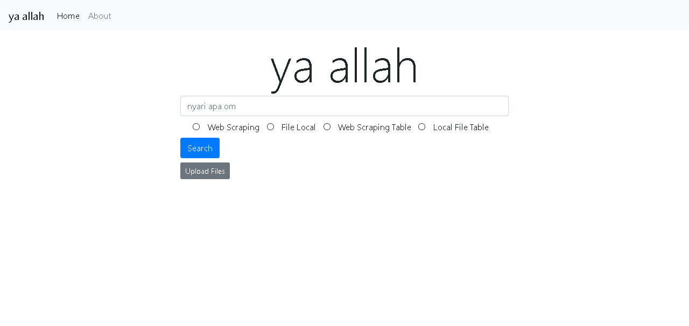

# Tugas Besar 2 Mata Kuliah Aljabar Linier dan Geometri
Aplikasi Dot Product pada Sistem Temu-balik Informasi\
Semester I 2020/2021

---

# Disusun oleh kelompok ya Allah , yang terdiri dari :
1. 13519007 - Muhammad Tito Prakasa
2. 13519018 - Mohammad Sheva Almeyda Sofjan
3. 13519064 - Aditya Bimawan

---
# Deskripsi Singkat : 
Webpage berupa search engine sederhana yang mampu menerima search query lalu menampilkan dokumen pada database secara terurut berdasarkan similaritas antara query dengan dokumen, serta menampilkan tabel kemunculan kata/term pada search query pada masing-masing dokumen.\
Dokumen dapat diperoleh menggunakan dua metode yaitu metode web scraping dan dengan cara mengupload file dokumen (.txt) .\
Program pada webpage umumnya dibuat menggunakan bahasa pemrograman Python 3 dengan framework Flask. 

---
# Instalasi package yang dibutuhkan

---
### Python 3

### nltk
pada terminal masukkan `pip install nltk` kemudian buka python di terminal dengan `python` dan jalankan program sebagai berikut:

    import nltk
    nltk.download('stopwords')
    nltk.download('punkt')

### pandas
`pip install pandas`

### flask
`pip install Flask`
`pip install WTForms`

## numpy
`pip install numpy`

### module lainnya
##### seharusnya sudah terinstall pada Python atau modul-modul diatas
* werkzeug
* pathlib
* json
* math
* re
* os

# Cara menjalankan web app
Pastikan package-package di atas sudah terinstal pada perangkat anda. /
Pastikan sudah berada di folder "Algeo02-19007" , bila tidak silahkan change directory pada terminal (cmd) menggunakan command 'cd' (tanpa tanda petik).\
Pada terminal(cmd pada OS Windows), lakukan : \
Masuk ke directory src (`cd src`) lalu ke folder flask (`cd flask`) dan jalankan flasksite.py (`python flasksite.py`) .\
Tunggu beberapa saat, jika sudah terdapat tampilan
```
 * Serving Flask app "flasksite" (lazy loading)
 * Environment: production
   WARNING: This is a development server. Do not use it in a production deployment.
   Use a production WSGI server instead.
 * Debug mode: on
 * Restarting with stat
 * Debugger is active!
 * Debugger PIN: XXX-XXX-XXX
 * Running on http://127.0.0.1:5000/ (Press CTRL+C to quit)
```
Maka anda dapat mengakses alamat webpage tersebut menggunakan browser anda (dalam kasus ini alamat : http://127.0.0.1:5000/ ) .\
Lalu akan muncul tampilan :



Setelah itu anda dapat memasukkan search query pada search bar yang tersedia, dan memilih salah satu diantara 4 opsi output yang tersedia .\
Untuk mengunggah file .txt, pastikan anda berada di homepage lalu tekan button "upload files" lalu "browse" dan tekan "upload" .\
Anda juga dapat menghapus semua file .txt yang sudah di upload menggunakan button "delete files".\

# Cara Memperbarui Dokumen Hasil Webscrape
Untuk melakukan aksi ini diperlukan satu package tambahan, yaitu:

### beautifulsoup4
`pip install beautifulsoup4`

Selanjutnya, pastikan terminal anda sudah berada di directory "Algeo02-19007". Selanjutnya ketik "cd src" tanpa kutip di terminal anda
lalu enter. Setelah itu jalankan program "webscraper.py" dengan cara ketikkan di terminal anda "python webscraper.py". Tunggu hingga
proses webscraping selesai dan voila! dokumen data di src/data/json/*.txt anda sudah diperbarui.

Selamat menikmati!.\

